# DCM — Decentralized Catalogue Management Platform

A flow-based decentralized-catalogue management platform for federated portals. DCM lets operators register remote catalogues, harvest their assets on a schedule, map remote schemas to a local canonical schema, transform records with deterministic RDF mappings or LLM prompts, and serve the unified local catalogue through a governed, auditable pipeline.

This README is the single source of truth for installing, configuring, deploying, and operating DCM. It covers every feature the platform exposes and every UI path a user takes.

---

## Table of Contents

1. [System Overview](#1-system-overview)
2. [Architecture](#2-architecture)
3. [Prerequisites](#3-prerequisites)
4. [Deployment with Docker](#4-deployment-with-docker)
5. [First-time Setup Walkthrough](#5-first-time-setup-walkthrough)
6. [Authentication and Access Control](#6-authentication-and-access-control)
7. [Schema Registry](#7-schema-registry)
8. [Catalogue Registry](#8-catalogue-registry)
9. [Harvester](#9-harvester)
10. [Local Catalogue](#10-local-catalogue)
11. [Admin Tools](#11-admin-tools)
12. [End-to-end Workflows](#12-end-to-end-workflows)
13. [API / Message Protocol](#13-api--message-protocol)
14. [Database Schema](#14-database-schema)
15. [Security](#15-security)
16. [Development and Build](#16-development-and-build)
17. [Troubleshooting](#17-troubleshooting)
18. [FAQ](#18-faq)

---

## 1. System Overview

DCM is composed of six backend modules that run as ORCE flows and a single-page Vue 3 dashboard that is served by the uibuilder node inside ORCE. All state is stored in MongoDB. The platform is multi-tenant-ready through role-based permissions and is designed for federated deployments where many remote catalogues are periodically harvested into a single local index.

At a high level, DCM does four things:

- **Register** remote data catalogues, their asset types, and API mappings (Catalogue Registry).
- **Model** local canonical schemas, remote schemas, and the transformations between them, including LLM prompts (Schema Registry).
- **Harvest** assets from remote catalogues on a schedule, validate and transform them, and persist them locally (Harvester + Local Catalogue).
- **Govern** everything with users, roles, audit logs, and real-time monitoring (Admin Tools + Auth).

---

## 2. Architecture

### 2.1 Modules

The backend is split into six ORCE flow files in `backend/src/`. Each module has its own flow tab and communicates with the others through link-in / link-out nodes on the dashboard router.

| # | Module | File | Route tag | SRS IDs |
|---|---|---|---|---|
| M1 | Schema Registry | `M1_DCM-SchemaRegistry_flow.json` | `schema-registry` | FR-SR-01 … FR-SR-13 |
| M2 | Catalogue Registry | `M2_DCM-CatalogueRegistry_flow.json` | `catalogue-registry` | FR-CR-01 … FR-CR-03 |
| M3 | Harvester | `M3_DCM-Harvester_flow.json` | `harvest` | FR-ACM-01 … FR-ACM-05 |
| M4 | Admin Tools | `M4_DCM-AdminTools_flow.json` | `admin-tools` | FR-AC-01 |
| M5 | Local Catalogue | `M5_DCM-LocalCatalogue_flow.json` | `local-catalogue` | FR-ACM-04 |
| M6 | Auth | `M6_DCM-Auth_flow.json` | `auth` | FR-AC-01 |

`base_flow.json` contains the uibuilder node, the message router switch, the token extractor, and the MongoDB client configuration. `full_assembled_out_flow.json` is a convenience file that concatenates all modules into one importable flow.


### 2.2 Runtime stack

- **ORCE 4.x** — the flow runtime.
- **ORCE-contrib-uibuilder 7.5.0** — the bridge between ORCE and the Vue 3 dashboard.
- **MongoDB 6.x** — the only persistence layer.
- **ORCE-contrib-mongodb4** — the Mongo client used by every DB node in the flows.
- **Vue 3.5 + esbuild + vite** — the frontend build chain.
- **CodeMirror 6** — the embedded code editor used in Prompts, Mappings, and RDF editors.

### 2.3 Message flow

Every client action is sent as a typed ORCE message with the shape:

```json
{
  "type": "saveProvider",
  "auth": { "userToken": "<token>", "clientId": "<uibuilder-client-id>" },
  "data": { "name": "openai-prod", "type": "openai", "apiKey": "sk-..." }
}
```

The message enters the backend at the uibuilder node, is normalized by the token extractor (`ff01000000000099`), routed by module (`ff01000000000020`), routed again by action (`aa01000000000005` inside the target module), authenticated (`auth000000000001`), permission-checked (`ee02000000000090`), and finally processed. Responses return via the shared `bb010000000000f0` link-out back to the dashboard.


---

## 3. Prerequisites

### 3.1 Runtime

| Component | Version | Notes |
|---|---|---|
| Node.js | 20 LTS or newer | ORCE 4 requires 18+, 20 is recommended. |
| MongoDB | 6.0 or newer | Replica set not required; single node is fine for dev. |
| Docker | 24.x or newer | Only if using the Docker deployment in §4. |
| Docker Compose | v2 plugin | Ships with modern Docker Desktop / Docker Engine. |

### 3.2 Build-time (only if you rebuild the frontend)

| Tool | Version |
|---|---|
| npm | 8.x |
| esbuild | 0.27.x (installed by `package.json`) |
| vite | 8.x beta (installed by `package.json`) |

### 3.3 Secrets you must provide

| Secret | Purpose | Where used |
|---|---|---|
| `DCM_KMS_KEY` | 32-byte hex key for AES-256-GCM encryption of provider API keys. | ORCE env. Auto-provisioned to `dcm-kms.key` on first run if not set. |
| `MONGO_URI` | MongoDB connection string. | ORCE env. Referenced by `b991ffcd8f6c360a` client config. |
| LLM provider keys | OpenAI / Anthropic / Ollama / Gemini keys. | Stored encrypted inside DCM via Schema Registry → Providers. **Not** env vars. |

Generate a fresh KMS key with:

```bash
node -e "console.log(require('crypto').randomBytes(32).toString('hex'))"
```

---

## 4. Deployment with Docker

This is the recommended path for any new installation. The stack consists ORCE (backend + UI).

For easy setup you have to run this command to bring up a docker container:

```bash
docker run -d -p 1880:1880 -p 8080:8080 ecofacis/dcm:v1
```

Then your instance is ready at: 

```text
http://localhost:1880  # DCM BackEnd
http://localhost:1880/ui  # DCM UI
http://localhost:8080  # FileBrowser
```

The default username/password for the BackEnd management is `admin`/`xfsc-orce`.

---

## 5. First-time Setup Walkthrough

### 5.1 Create an LLM Provider

Navigate to **Schema Registry → Providers → + Add Provider**. Fill:

| Field | Example |
|---|---|
| Name | `openai-prod` |
| Type | `openai` |
| API Endpoint | `https://api.openai.com/v1` |
| API Key | `sk-...` (your real key) |
| Supported Models | `gpt-4o, gpt-4-turbo` |
| Default | yes (only for the first provider) |

Click **Save**. The provider appears in the table with a "Key set" badge.


### 5.5 Register your first Remote Catalogue

Navigate to **Catalogue Registry → + Register Remote Catalogue**. Fill the form (§9.1) and click **Save**.


### 5.6 Upload a Local Schema and a Remote Schema

Navigate to **Schema Registry → Local Schemas / Remote Schemas** (§7) and upload your canonical target schema plus the remote shape you want to harvest from.

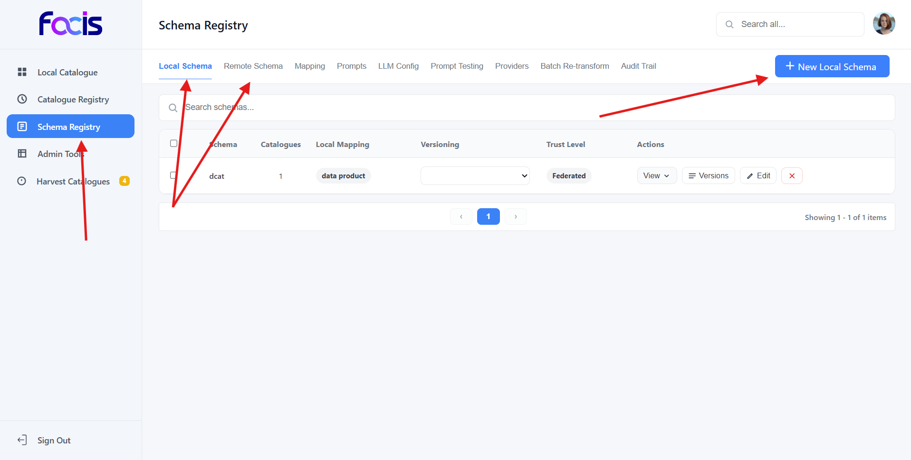


### 5.7 Create a Mapping and a Prompt

Link the remote schema to the local schema via **Schema Registry → Mappings** and optionally attach a **Prompt** from **Schema Registry → Prompts** for the LLM-assisted transformation.

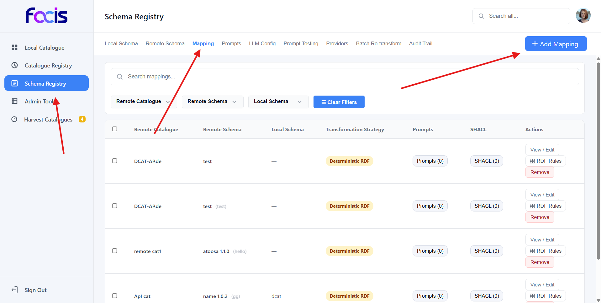

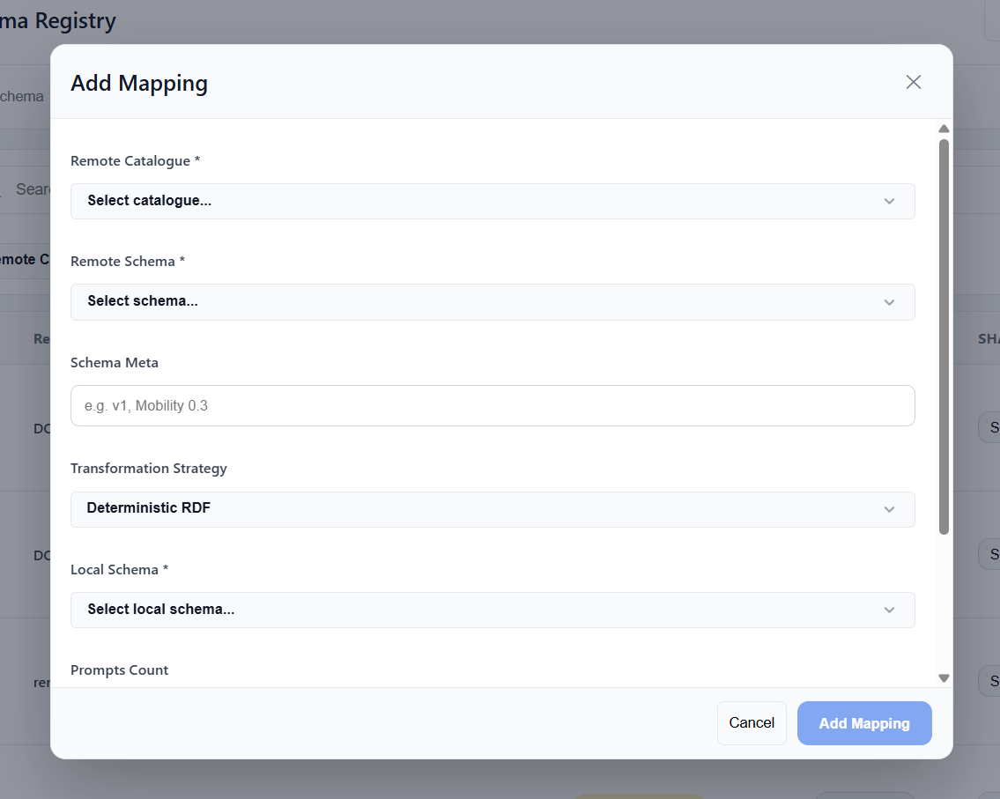

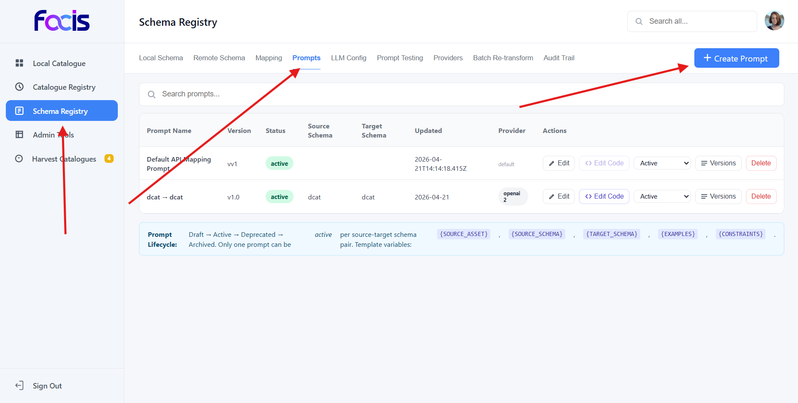

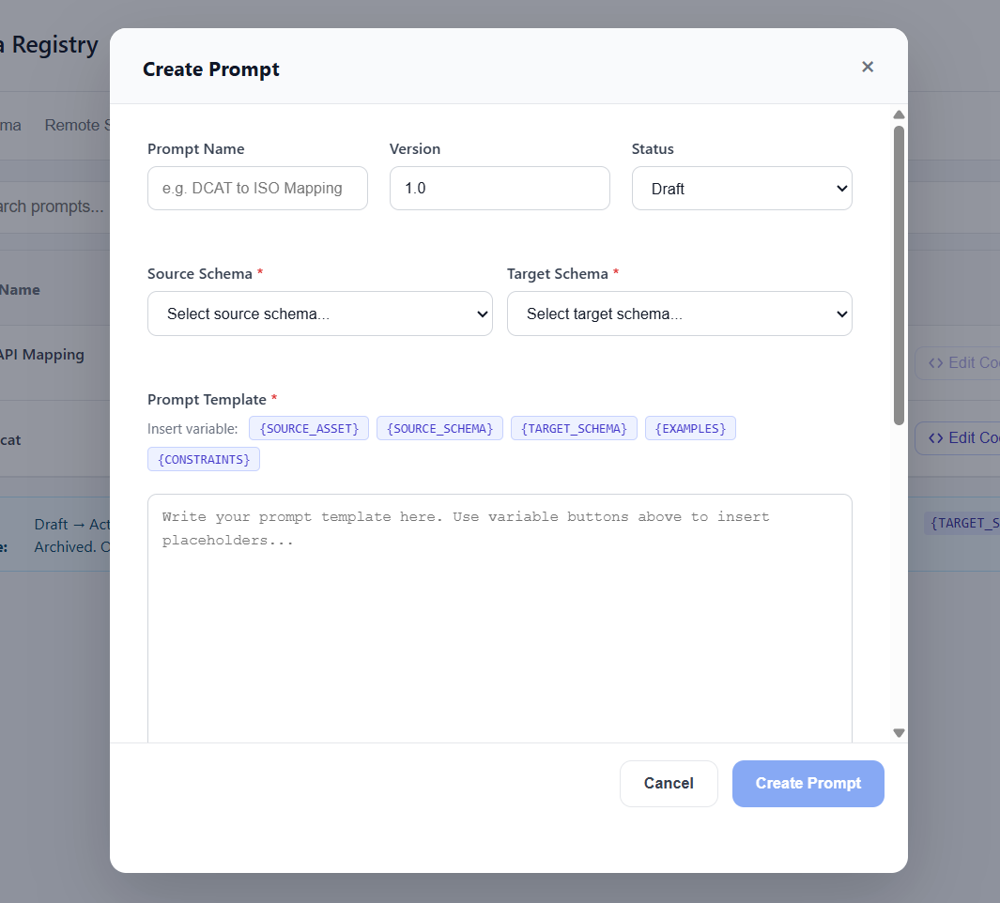

### 5.8 Start your first Harvest

Navigate to **Harvester → Start Harvest** (§9.1), pick the catalogue, and run.

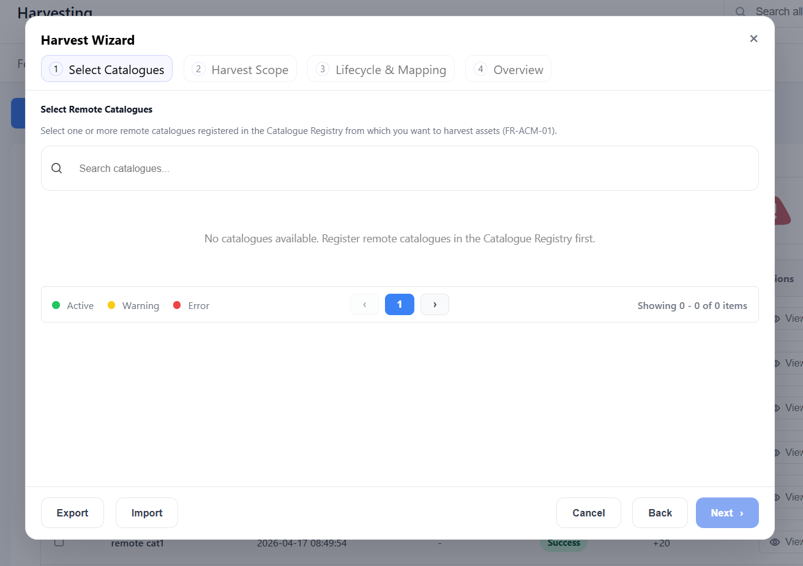

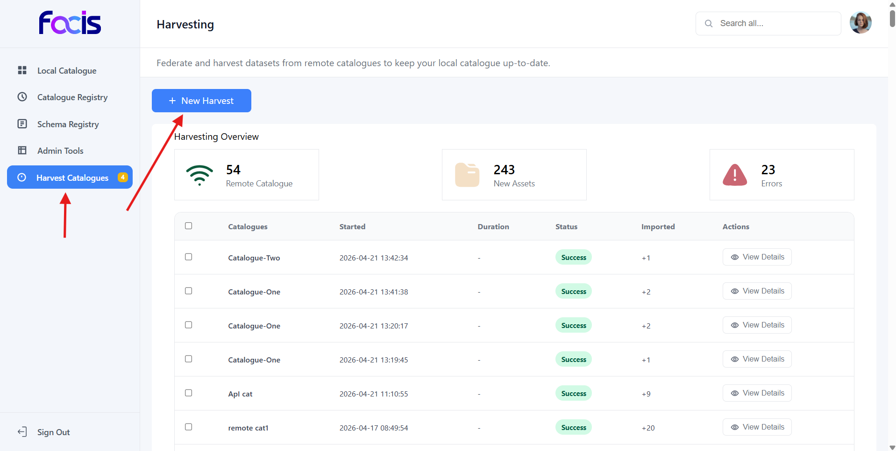

You are now fully operational.

---

## 6. Authentication and Access Control

### 6.1 Login

URL: `http://<host>:1880/ui/login/`. The Vue login page submits `{ type: "login", data: { username, password } }` to the `auth` route. The backend verifies the bcrypt hash in `dcm_users`, resolves the role's permissions from `dcm_roles`, creates a session document in `auth_sessions` with a 24-hour `expiresAt`, and returns `{ userToken, username, roles, permissions, accessAreas }`. The frontend stores `userToken` in both `localStorage.authToken` and the `userToken` cookie; the uibuilder client ID is in the `uibuilder-client-id` cookie.

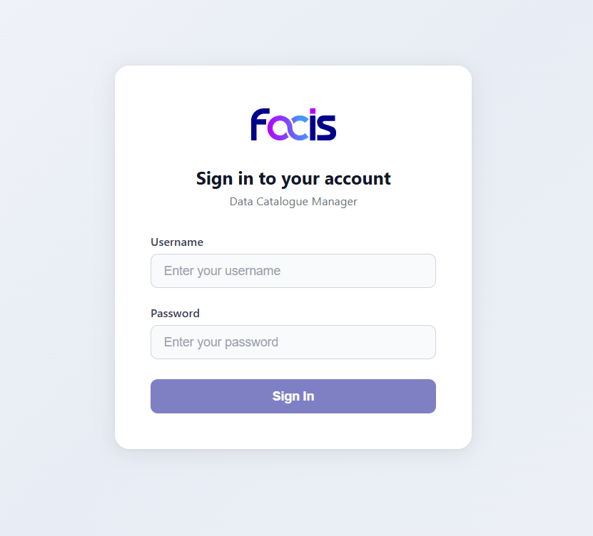

### 6.2 Session lifecycle

- On page load, the Vue app sends `checkAuth` with the stored `userToken`.
- `hydrateSession` rehydrates the full user + permissions payload after a hard refresh.
- `logOut` deletes the session row.
- All other messages carry the token in `msg._token` (top-level), `msg.data.token`, `msg.payload.token`, and as a suffix on `msg.topic` (belt-and-suspenders against uibuilder transport quirks). The auth resolver (`auth000000000001`) searches every location.

### 6.3 Roles and permissions

Permissions are flat strings. Recognized permissions:

| Permission | Grants |
|---|---|
| `*` / `admin` | Everything (wildcard). |
| `schema.registry.read` | List prompts, providers, schemas, mappings, audit, usage. |
| `schema.registry.create` | Create prompt, provider, schema, mapping, test case, LLM config. |
| `schema.registry.update` | Update prompt, status, enhance, activate version, system settings. |
| `schema.registry.delete` | Delete prompt, provider, schema, mapping, audit. |
| `catalogue.registry.read/create/update/delete` | Catalogue Registry CRUD. |
| `harvest.run` | Start / pause / resume / cancel harvests. |
| `harvest.read` | View harvest runs, logs, provenance. |
| `local.catalogue.read/update/delete` | Local Catalogue CRUD. |
| `admin.users.manage` | Create/update/delete users and roles. |
| `admin.audit.read` | View audit log and monitoring. |

Every action is gated by the **Centralized Permission Gate** (`ee02000000000090` in M1 and equivalents in other modules). A denied action returns `{ ok: false, code: "permission_denied", error: "Insufficient permissions. Required: ..." }` and writes an `access.denied` row to `dcm_audit_log`.

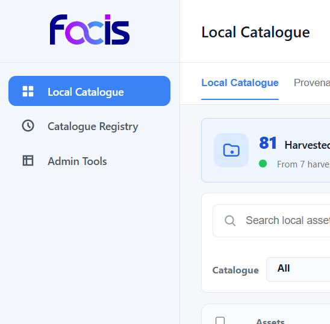

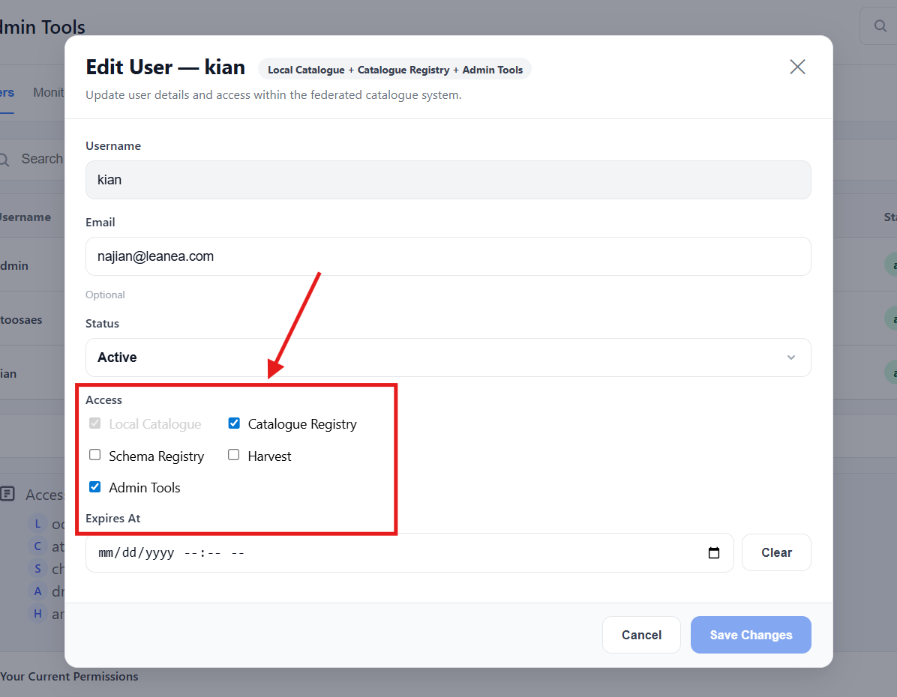

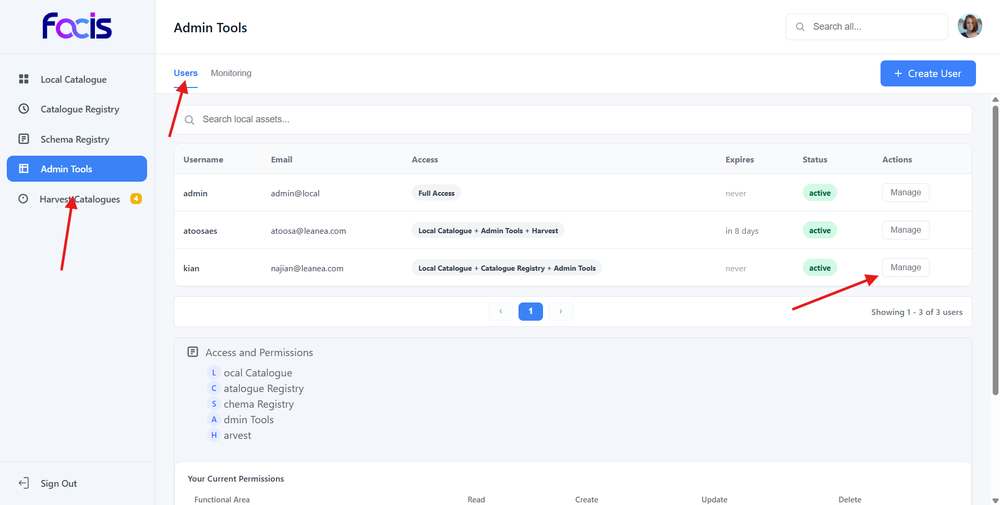

### 6.4 Changing a password

Top-right profile menu → **Change password** → enter current + new. The backend reverifies the current password before updating the bcrypt hash.


---

## 7. Schema Registry

URL: **Dashboard → Schema Registry**. Schema Registry is the most feature-rich module. It governs every schema, prompt, mapping, and LLM configuration that DCM uses during transformation.

### 7.1 Local Schemas

The canonical schemas used to store harvested data locally. Each version is immutable; activating a version replaces the default for new harvests.


| UI path | Action |
|---|---|
| **Schema Registry → Local Schemas** | List all local schemas. |
| **+ Add Local Schema** | Upload a new schema. Fields: `schema` (name), `format` (SHACL / JSON-Schema / XSD), `body` (the schema text), `namespaces`, `status` (draft/active/deprecated), `versioning` (e.g. `v1.0`), `trustLevel` (Federated / Internal / External), `description`. |
| Row → **Versions** | See every version of a given schema. Activate a version by clicking **Activate**. |
| Row → **Edit** | Edit the current version. Editing creates a new version automatically. |
| Row → **Delete** | Delete a schema. Blocked if the schema is referenced by any Prompt or Mapping; the blocker lists the referring rows so you can remove those first. |

### 7.2 Remote Schemas

Descriptions of the shapes that remote catalogues publish. Used as the **source** in mappings and prompts.


| UI path | Action |
|---|---|
| **Schema Registry → Remote Schemas** | List all remote schemas. |
| **+ Add Remote Schema** | Fields: `name`, `format` (json-schema / xsd / SHACL / custom), `body`, `namespaces`, `version`, `status`, `trustLevel`, `catalogueIds` (which remote catalogues use this schema), `description`, `author`. |
| Row → **Edit / Delete** | Same semantics as Local Schemas. |

### 7.3 Mappings

Declarative links between a remote schema and a local schema. Each mapping declares a `transformationStrategy`:

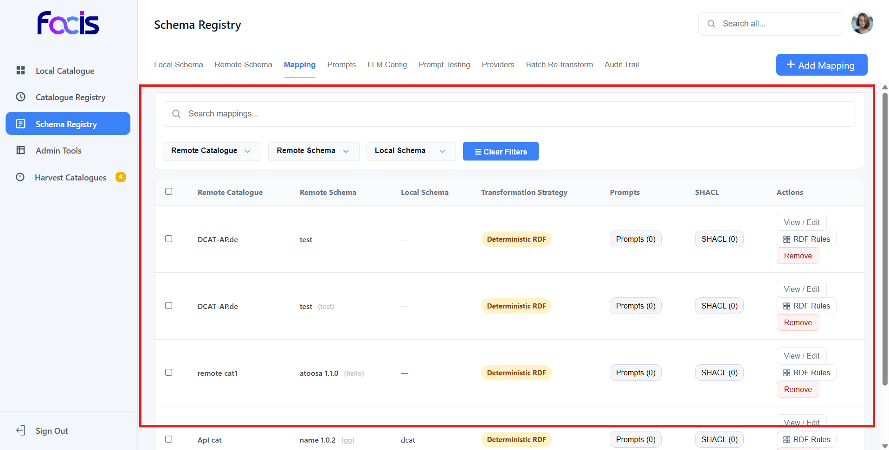

- **Deterministic RDF** — applies the attached RDF mapping config (§8.4) against the source record.
- **LLM Prompt** — runs the attached Prompt (§8.5) through the selected LLM Provider.
- **Hybrid** — deterministic first; if the SHACL validation fails, falls back to the prompt.

| UI path | Action |
|---|---|
| **Schema Registry → Mappings** | List all mappings. |
| **+ Add Mapping** | Pick `remoteCatalogue`, `remoteSchema`, `localSchema`, `transformationStrategy`, and optionally a `promptId` and an `rdfMappingConfig`. |
| Row → **RDF Config** | Edit the preserve-namespace list and SHACL shape reference. |
| Row → **Test** | Provide a sample source record, run the mapping, and see the produced RDF / JSON plus SHACL validation output, retained vs. discarded triples. |
| Row → **Delete** | Deletes the mapping row. |

### 7.4 Prompts

Template-driven LLM instructions used when a mapping's strategy is `LLM Prompt` or `Hybrid`. Templates support the variables `{SOURCE_SCHEMA}`, `{TARGET_SCHEMA}`, `{EXAMPLES}`, `{CONSTRAINTS}` which are expanded at runtime with the mapping's context.

| UI path | Action |
|---|---|
| **Schema Registry → Prompts** | List all prompts. |
| **+ New Prompt** | Fields: `sourceSchema`, `targetSchema`, `template`, `examples`, `constraints`, `status` (draft / staged / active / deprecated), `LLM Provider Override` (a dropdown of all active Providers). |
| Row → **Enhance ✨** | Sends the current `template` plus context to the selected Provider and asks OpenAI / Anthropic / Ollama to rewrite it. The improved prompt replaces the template field. |
| Row → **Dry-run** | Execute the prompt against a sample source record and see the transformed output without persisting anything. |
| Row → **Versions** | Each save creates a version. Activate a version to make it the default for downstream mappings. |
| Row → **Edit / Delete** | Standard. |

**LLM Provider precedence** (FR-SR-12): `prompt.providerId > mapping.catalogue.providerId > systemSettings.default`. If no Provider has a usable key, every LLM-dependent action returns `LLM not configured`.

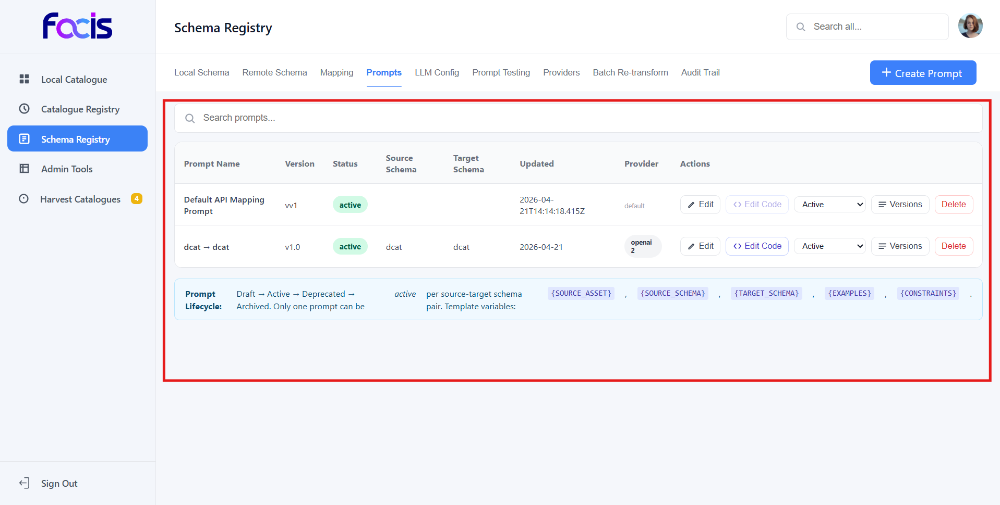

### 7.5 Providers

Encrypted credentials for the LLM services DCM calls.

| UI path | Action |
|---|---|
| **Schema Registry → Providers** | Table of providers with a **Key** column showing **"Key set"** (green) or **"No key"** (red). |
| **+ Add Provider** | Fields: `name`, `type` (openai / anthropic / ollama / google / custom), `apiEndpoint`, `apiKey` (password field with Show/Hide toggle), `models` (comma-separated), `rateLimits`, `timeout`, `isDefault`, `precedence`, `status`. |
| Row → **Edit** | API Key field is empty on open; leave blank to keep the existing encrypted key, or type a new value to rotate. The hint "A key is already stored for this provider (encrypted)" appears when a key is on file. |
| Row → **Reorder** | Drag-drop changes `precedence`. |
| Row → **Delete** | Delete the provider. |

API keys are encrypted with **AES-256-GCM** using the `DCM_KMS_KEY`. The `listProviders` response never contains the ciphertext — only a boolean `hasKey`.

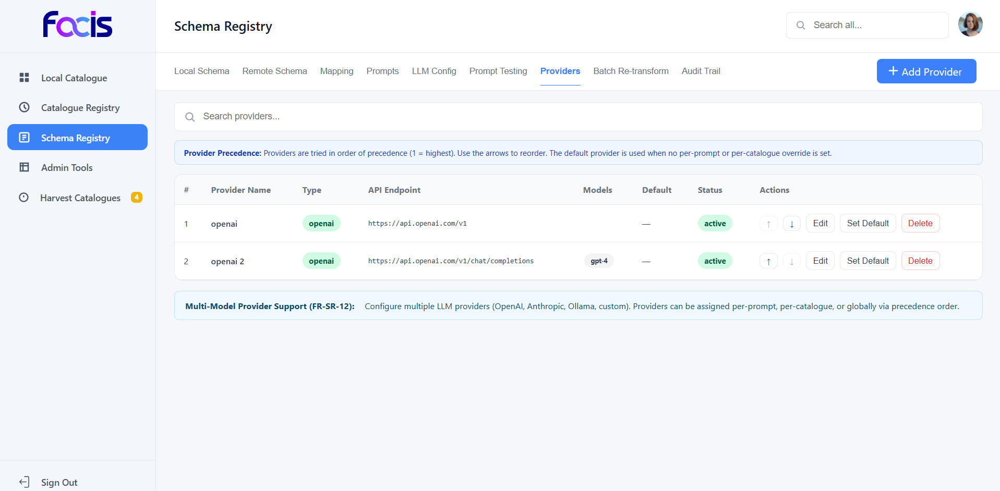

### 7.6 LLM Configs

Per-use-case tuning for a given Provider: temperature, max tokens, response format.

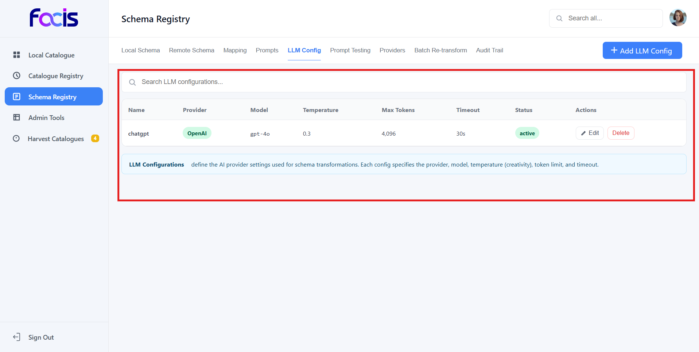

| UI path | Action |
|---|---|
| **Schema Registry → LLM Configs** | List tuning profiles. |
| **+ Add Config** | Fields: `name`, `provider`, `model`, `temperature`, `maxTokens`, `timeout`, `status`. |
| Row → **Edit / Delete** | Standard. |

### 7.7 Test Cases

Reusable (sample input, expected output) pairs attached to Prompts / LLM Configs for regression testing.

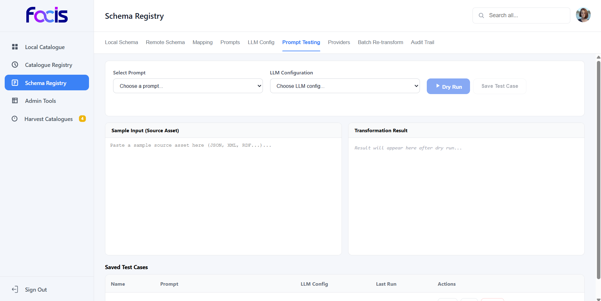

| UI path | Action |
|---|---|
| **Schema Registry → Test Cases** | List all test cases. |
| **+ Add Test Case** | Fields: `name`, `promptId`, `llmConfigId`, `sampleInput`, `expectedOutput`. |
| Row → **Run** | Executes and stores `lastResult` + `lastRunAt`. |
| Row → **Edit / Delete** | Standard. |

### 7.8 Transformation Audit

Append-only audit of every transformation event.


| UI path | Action |
|---|---|
| **Schema Registry → Audit** | Paginated, filterable table (by catalogue, asset type, strategy, outcome, date range). |
| Row → **View** | Full JSON: source record, applied mapping, LLM response, SHACL report, stored triples. |
| **Export** | CSV / JSON export of the filtered set. |
| Row → **Delete / Update** | Only for administrators. |

### 7.9 Batch Retransform

Re-runs a mapping across every affected local asset (useful after editing a prompt or activating a new schema version).


| UI path | Action |
|---|---|
| **Schema Registry → Batch Retransform** | Choose scope (`all`, `catalogue:<id>`, `mapping:<id>`) and whether to dry-run. |
| **Start** | Launches progress stream; see `batchRetransformProgress` events with `processedAssets`, `successCount`, `errorCount`. |
| **Cancel** | Stops the run mid-flight. |

### 7.10 System Settings

Global key/value pairs used by other modules. Typical keys: `default.providerId`, `default.llmConfigId`, `harvest.schedule.default`, `audit.retentionDays`.

UI: **Schema Registry → System Settings**. Editable only by `admin.users.manage` holders.

---

## 8. Catalogue Registry

URL: **Dashboard → Catalogue Registry**. Defines the outward-facing catalogues DCM talks to.

### 8.1 Remote Catalogues

A Remote Catalogue is an external data portal (CKAN, DCAT-AP, a custom REST service, etc.) whose inventory DCM harvests.


| UI path | Action |
|---|---|
| **Catalogue Registry → Remote Catalogues** | List all registered catalogues. |
| **+ Register Remote Catalogue** | Fields: `catalogName`, `baseEndpoint` (root URL), `interfaceType` (REST / SPARQL / OAI-PMH / custom), `auth` (`{ type: "bearer" \| "basic" \| "apiKey" \| "none", token / user / pass / header: value }`), `providerId` (optional — catalog-level LLM provider override), `description`. |
| Row → **Test Connection** | Issues a sanity-check GET against the base endpoint and shows the raw response. |
| Row → **Edit / Delete** | Standard. |
| **Upload Catalog JSON** | Bulk-register via a JSON file. |

### 8.2 Asset Types

The record types a remote catalogue exposes (`dataset`, `service`, `organization`, etc.). Each is linked to a remote schema so downstream mappings know what to expect.


| UI path | Action |
|---|---|
| Remote Catalogue row → **Asset Types** | List the catalogue's asset types. |
| **+ Add Asset Type** | Fields: `name`, `description`, `remoteSchemaId`. |
| Row → **Edit / Delete** | Standard. |

### 8.3 API Mappings

A per-(catalogue, asset type) definition of **how to fetch records** from the remote API: method, path template, query params, headers, body template.

| UI path | Action |
|---|---|
| Asset Type row → **API Mapping** | Shows the current mapping or an empty form. |
| **Generate with AI** | Attaches the selected prompt + catalogue context and asks the LLM to propose a concrete API-request shape (method/path/query/headers/body). Returns strict JSON via `response_format: { type: "json_object" }`. |
| **Save** | Persists the mapping; becomes the template the Harvester uses (§10). |
| **Delete** | Removes the mapping. |

---

## 9. Harvester

URL: **Dashboard → Harvester**. Runs the actual data ingestion.

### 9.1 Start a Harvest

1. **Harvester → Start Harvest**.
2. Pick a catalogue. The form lists every Asset Type the catalogue has an API Mapping for.
3. Optional: restrict to a subset of asset types, or set `sinceWatermark` for incremental harvesting.
4. Click **Start**. A progress bar and live log stream appear.

Under the hood DCM:


- Resolves the API Mapping for each asset type.
- Issues paginated requests against the remote endpoint.
- Validates each response record against the Remote Schema (SHACL where applicable).
- Runs the configured Mapping (deterministic / LLM / hybrid).
- Writes the transformed record to the local catalogue (§10) and a row to the Transformation Audit (§7.8).

### 9.2 List and Monitor Runs

| UI path | Action |
|---|---|
| **Harvester → Runs** | Every past and current harvest: `runId`, catalogue, status (`queued` / `running` / `paused` / `completed` / `cancelled` / `failed`), totals, `startedAt`, `completedAt`. |
| Row → **Detail** | Per-asset-type counters, retries, error summary. |
| Row → **Logs** | Live-tailing log stream with severity filters. |
| Row → **Provenance** | For each harvested record: source URL, fetch timestamp, applied mapping version, prompt version, SHACL outcome, generated triples. |
| Row → **Pause / Resume / Cancel** | Lifecycle controls. |

### 9.3 Scheduling

Set a catalogue's cron schedule from **Catalogue Registry → Remote Catalogues → Edit → Schedule**. The harvester reads active schedules on boot and via `startHarvest({ scheduled: true })`.

---

## 10. Local Catalogue

URL: **Dashboard → Local Catalogue**. The unified, transformed view of every harvested record.

| UI path | Action |
|---|---|
| **Local Catalogue → Browse** | Filterable, faceted table over all assets. Facets: catalogue, asset type, tag, harvested date, trust level. |
| Row → **Detail** | Original source record + transformed triples / JSON + SHACL report + provenance chain. |
| Row → **Update** | Edit local metadata (tags, notes) without touching the source. |
| Row → **Delete** | Removes the local copy. The next harvest will restore it unless its source is also gone. |
| **Stats** | Totals per catalogue, per asset type, per trust level; freshness histogram; error rates. |
| **Provenance Explorer** | Query provenance by asset ID, mapping version, prompt version, or time window. |


---

## 11. Admin Tools

URL: **Dashboard → Admin Tools**. Restricted to users holding `admin.users.manage` / `admin.audit.read`.

### 11.1 Users

| UI path | Action |
|---|---|
| **Admin Tools → Users** | Table of users with `username`, `email`, `roles`, `accessAreas`, `status`, `lastLoginAt`. |
| **+ Create User** | Fields: `username`, `email`, password (bcrypt-hashed server-side), `roles` (multi-select from existing roles), `accessAreas`, `status`. |
| Row → **Edit** | Same fields; password fields are blank and only rotated if filled. |
| Row → **Detail** | Activity summary: logins, audit entries, owned resources. |
| Row → **Delete** | Soft-delete (status → `disabled`). |


### 11.2 Roles

| UI path | Action |
|---|---|
| **Admin Tools → Roles** | Table with `name`, `permissions`, `userCount`. |
| **+ Create Role** | Fields: `name`, `permissions` (multi-select). |
| Row → **Edit / Delete** | Delete is blocked if any user is assigned the role. |


### 11.3 Audit Log

| UI path | Action |
|---|---|
| **Admin Tools → Audit** | Every authenticated action: `timestamp`, `actor`, `area`, `action`, `target`, `result`, `before`, `after`. |
| **Filter** | By actor, area, action, date range, result. |
| **Export** | CSV / JSON. |

### 11.4 Monitoring Overview

| UI path | Action |
|---|---|
| **Admin Tools → Monitoring** | Real-time overview: active sessions, harvest runs in flight, MongoDB operation rate, queue depth, recent errors, LLM usage (`getLlmUsage`). |

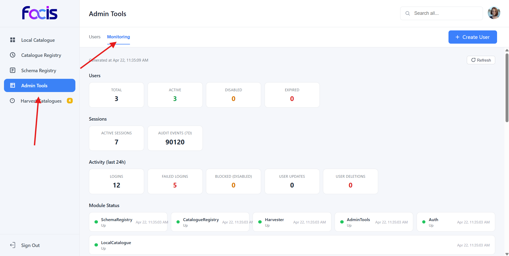

---

## 12. End-to-end Workflows

### 12.1 Onboard a new data portal

1. **Catalogue Registry → + Register Remote Catalogue** → fill metadata + auth, Save.
2. **Catalogue Registry → (row) → Test Connection** — must return HTTP 200.
3. **Schema Registry → + Add Remote Schema** — paste the portal's schema, link it to the catalogue.
4. **Catalogue Registry → (row) → Asset Types → + Add** — one per asset type on the portal.
5. **Catalogue Registry → (row) → (asset type) → API Mapping → Generate with AI** (optional) or fill manually, Save.
6. **Schema Registry → + Add Local Schema** — the canonical target, Save and Activate the version.
7. **Schema Registry → Mappings → + Add** — pick remote and local schemas, pick strategy.
8. **Schema Registry → Prompts → + New Prompt** (if strategy is LLM or Hybrid) — compose template, optionally ✨ Enhance.
9. **Harvester → Start Harvest** — pick the catalogue, Start.
8. **Local Catalogue → Browse** — the first records appear within seconds.

### 12.2 Rotate an LLM provider key

1. **Schema Registry → Providers → (row) → Edit**.
2. Type the new `sk-...` in API Key.
3. Save. Toast reads "Provider updated." and badge stays "Key set".
4. Back in the Providers table, Key column still shows "Key set" — the encrypted blob is refreshed.

### 12.3 Retransform everything after editing a prompt

1. **Schema Registry → Prompts → (row) → Edit** — adjust template, Save.
2. **Schema Registry → Prompts → (row) → Versions → Activate** the new version.
3. **Schema Registry → Batch Retransform** — scope = `mapping:<id>` (the mapping that uses this prompt), **Start**.
4. Watch the progress widget; when it hits 100%, the Local Catalogue is caught up.

### 12.4 Investigate a failing harvest

1. **Harvester → Runs → (run) → Logs** — filter by `error`.
2. Copy the offending `assetId`, then **Schema Registry → Transformation Audit → filter by assetId**.
3. The audit row shows the exact prompt, response, SHACL report. Edit the prompt or mapping and re-harvest.

### 12.5 Add a new user and restrict access

1. **Admin Tools → Roles → + Create Role** — name `harvest-operator`, permissions `harvest.run`, `harvest.read`, `catalogue.registry.read`, `local.catalogue.read`.
2. **Admin Tools → Users → + Create User** — assign role `harvest-operator`.
3. Hand the user their credentials; they log in and only see Harvester + Catalogue Registry + Local Catalogue.

---

## 13. API / Message Protocol

All messages are JSON sent through the uibuilder WebSocket. Every message must include a `type` and an `auth` block.

### 13.1 Complete action list

**Auth** (M6): `login`, `logOut`, `checkAuth`, `hydrateSession`, `changePassword`.

**Schema Registry** (M1): `listPrompts`, `createPrompt`, `updatePrompt`, `deletePrompt`, `enhancePrompt`, `updatePromptStatus`, `updatePromptCode`, `dryRunPrompt`, `listTestCases`, `saveTestCase`, `deleteTestCase`, `listLlmConfigs`, `saveLlmConfig`, `deleteLlmConfig`, `listProviders`, `saveProvider`, `deleteProvider`, `reorderProvider`, `startBatchRetransform`, `cancelBatchRetransform`, `saveLocalSchema`, `listLocalSchemas`, `deleteLocalSchema`, `saveMapping`, `listMappings`, `deleteMapping`, `saveRemoteSchema`, `listRemoteSchemas`, `deleteRemoteSchema`, `listLocalSchemaVersions`, `activateLocalSchemaVersion`, `validateSampleAsset`, `listPromptVersions`, `getLlmUsage`, `getSystemSettings`, `setSystemSetting`, `saveRdfMappingConfig`, `testRdfMapping`, `executeHybridTransform`, `listTransformationAudit`, `exportTransformationAudit`, `updateTransformationAudit`, `deleteTransformationAudit`.

**Catalogue Registry** (M2): `registerRemoteCatalog`, `getCatalogRegistry`, `updateRemoteCatalog`, `deleteRemoteCatalog`, `uploadCatalogJson`, `listAssetTypes`, `saveAssetType`, `updateAssetType`, `deleteAssetType`, `testRemoteCatalogConnection`, `listApiMappings`, `saveApiMapping`, `deleteApiMapping`, `generateApiMappingWithAi`.

**Harvester** (M3): `getHarvestCatalogues`, `startHarvest`, `listHarvestRuns`, `getHarvestRunDetail`, `listHarvestLogs`, `listHarvestProvenance`, `pauseHarvest`, `resumeHarvest`, `cancelHarvest`.

**Local Catalogue** (M5): `getLocalCatalogue`, `getLocalAssetDetail`, `deleteLocalAsset`, `updateLocalAsset`, `getLocalProvenance`, `getLocalStats`.

**Admin Tools** (M4): `listUsers`, `getAdminTools`, `getUserDetail`, `createUser`, `updateUser`, `deleteUser`, `listRoles`, `createRole`, `updateRole`, `deleteRole`, `listAudit`, `getMonitoringOverview`.

### 13.2 Request envelope

```json
{
  "type": "<action>",
  "auth": { "userToken": "<token>", "clientId": "<uibuilder-client-id>" },
  "data": { "<action-specific-fields>": "..." }
}
```

### 13.3 Response envelope

Success:
```json
{ "action": "<action>", "status": "success", "ok": true, "<action-specific-fields>": "..." }
```

Error:
```json
{ "action": "<action>", "ok": false, "status": "error", "code": "<machine-code>", "error": "<human-readable>" }
```

### 13.4 Known error codes

| Code | Meaning |
|---|---|
| `not_authenticated` | No valid session token. |
| `permission_denied` | Role is missing the required permission. |
| `user_not_found` | Session valid but dcm_users row missing. |
| `missing_api_key` | saveProvider called with no apiKey on create. |
| `encryption_error` | KMS key not available / AES failure. |
| `referenced` | Delete refused because the target is referenced; `by` lists the referrers. |
| `validation_failed` | Input failed field validation; `details` enumerates fields. |
| `upstream_error` | External HTTP call (LLM / remote catalogue) failed; `upstream.status` and `upstream.body` carry context. |

---

## 14. Database Schema

Primary MongoDB collections. All store timestamps as ISO strings.

| Collection | Purpose | Notable fields |
|---|---|---|
| `dcm_users` | Platform users. | `username`, `email`, `passwordHash`, `roles`, `accessAreas`, `status`, `lastLoginAt`. |
| `dcm_roles` | Role definitions. | `name`, `permissions[]`. |
| `dcm_audit_log` | Append-only audit. | `timestamp`, `actor`, `area`, `action`, `target`, `before`, `after`, `result`. |
| `auth_sessions` | Active sessions. | `token`, `username`, `createdAt`, `expiresAt`. |
| `sr_providers` | LLM providers. | `id`, `name`, `type`, `apiEndpoint`, `apiKey` (`{ct,iv,tag}` encrypted), `models`, `isDefault`, `precedence`, `status`. |
| `sr_llm_configs` | Tuning profiles. | `id`, `name`, `provider`, `model`, `temperature`, `maxTokens`, `timeout`. |
| `sr_prompts` | Prompt templates. | `id`, `sourceSchema`, `targetSchema`, `template`, `examples`, `constraints`, `providerId`, `version`, `status`. |
| `sr_prompt_versions` | Prompt history. | `promptId`, `version`, `template`, `activatedAt`. |
| `sr_test_cases` | Regression tests. | `id`, `name`, `promptId`, `llmConfigId`, `sampleInput`, `expectedOutput`, `lastResult`, `lastRunAt`. |
| `sr_local_schemas` | Canonical schemas. | `id`, `schema`, `format`, `body`, `namespaces`, `status`, `versioning`, `trustLevel`. |
| `sr_local_schema_versions` | Local schema history. | `schema`, `version`, `body`, `activatedAt`. |
| `sr_remote_schemas` | External schemas. | `id`, `name`, `format`, `body`, `namespaces`, `version`, `catalogueIds`. |
| `sr_mappings` | Remote→local mappings. | `id`, `remoteCatalogueId`, `remoteSchemaId`, `localSchemaId`, `transformationStrategy`, `promptId`, `rdfMappingConfig`. |
| `sr_transformation_audit` | Per-record transformation trail. | `timestamp`, `assetId`, `mappingId`, `promptVersion`, `inputHash`, `outputHash`, `shaclResult`. |
| `cr_remote_catalogues` | Remote catalogues. | `id`, `catalogName`, `baseEndpoint`, `interfaceType`, `auth`, `providerId`, `schedule`. |
| `cr_asset_types` | Per-catalogue asset types. | `id`, `catalogueId`, `name`, `description`, `remoteSchemaId`. |
| `cr_api_mappings` | Fetch definitions. | `id`, `catalogueId`, `assetTypeId`, `method`, `pathTemplate`, `queryParams`, `headers`, `bodyTemplate`. |
| `harvest_runs` | Harvest lifecycle rows. | `id`, `catalogueId`, `status`, `totals`, `startedAt`, `completedAt`. |
| `harvest_logs` | Log stream per run. | `runId`, `timestamp`, `severity`, `message`. |
| `harvest_provenance` | Source tracking per asset. | `assetId`, `sourceUrl`, `fetchedAt`, `mappingVersion`, `promptVersion`. |
| `local_catalogue` | The transformed records. | `assetId`, `catalogueId`, `assetTypeId`, `triples` / `payload`, `trustLevel`, `harvestedAt`. |
| `local_stats_cache` | Precomputed counters. | `key`, `value`, `asOf`. |

Recommended indexes:

```js
db.sr_providers.createIndex({ id: 1 }, { unique: true });
db.sr_prompts.createIndex({ id: 1 }, { unique: true });
db.sr_local_schemas.createIndex({ id: 1 }, { unique: true });
db.sr_remote_schemas.createIndex({ id: 1 }, { unique: true });
db.sr_mappings.createIndex({ id: 1 }, { unique: true });
db.auth_sessions.createIndex({ token: 1 }, { unique: true });
db.auth_sessions.createIndex({ expiresAt: 1 }, { expireAfterSeconds: 0 });
db.local_catalogue.createIndex({ assetId: 1 }, { unique: true });
db.local_catalogue.createIndex({ catalogueId: 1, assetTypeId: 1 });
db.harvest_runs.createIndex({ startedAt: -1 });
db.sr_transformation_audit.createIndex({ timestamp: -1 });
db.dcm_audit_log.createIndex({ timestamp: -1 });
```


---

## 15. Security

### 15.1 Threat model summary

| Risk | Mitigation |
|---|---|
| API-key exfiltration | All provider keys encrypted at rest with AES-256-GCM. `listProviders` strips the ciphertext before returning. |
| Session hijacking | 24-hour session expiry with server-side revocation via `logOut`. Tokens are UUID-style random strings, not JWTs. |
| Brute-force login | Rate-limit the login endpoint at the reverse proxy (see §14.4). Passwords are bcrypt with 10 rounds. |
| Privilege escalation | Centralized Permission Gate runs on every action; there is no "raw" endpoint that skips it. |
| SQL/NoSQL injection | All Mongo queries use parameterized objects, never string concatenation. |
| XSS | Vue 3 auto-escapes by default. No `v-html` is used on user-provided strings. |
| CSRF | uibuilder uses WebSockets with a server-issued `clientId` cookie; cross-origin browsers cannot forge. |

### 15.2 KMS key handling

The 32-byte AES key lives at `$NR_USER_DIR/dcm-kms.key` (file mode 0600). Back it up. If you lose it, **every encrypted provider key becomes unrecoverable** — you must re-enter each key via **Schema Registry → Providers → Edit**.

Rotation: generate a new key, decrypt all providers with the old, re-encrypt with the new, then swap the file. A dedicated rotation script is tracked as a future task.

### 15.3 Secrets hygiene

- **Never** log API keys. The flows only emit `apiKey.hasCt=true/false`.
- Strip `DCM_KMS_KEY`, `MONGO_INITDB_ROOT_PASSWORD`, and any LLM keys from exported flows before sharing `flows.json`.

### 15.4 Reverse proxy / TLS

ORCE does not provide TLS termination. In production, put nginx / Caddy / Traefik in front of ORCE and terminate TLS there. Example nginx snippet:

```nginx
server {
  listen 443 ssl http2;
  server_name dcm.example.com;
  ssl_certificate     /etc/ssl/certs/dcm.crt;
  ssl_certificate_key /etc/ssl/private/dcm.key;

  location / {
    proxy_pass http://127.0.0.1:1880;
    proxy_http_version 1.1;
    proxy_set_header Upgrade $http_upgrade;
    proxy_set_header Connection "upgrade";
    proxy_set_header Host $host;
  }

  location /red/ {
    # Protect the ORCE editor
    auth_basic "DCM Editor";
    auth_basic_user_file /etc/nginx/htpasswd;
    proxy_pass http://127.0.0.1:1880/red/;
  }
}
```

Also lock the ORCE editor itself by adding an `adminAuth` block to `settings.js`.

---

## 16. Development and Build

### 16.1 Frontend dev loop

```bash
cd dcm-source
npm install
npm run dev        # esbuild --watch + `npx serve public`
```

Open `http://localhost:5173/`. This runs with the mock adapter so the UI works without a backend. Toggle the mock explicitly by opening the browser console and running `window.__VITE_USE_MOCK = 'true'` before first render.

### 16.2 Production build

```bash
npm run build      # node build.js
```

`public/index.html`, `public/index.js`, `public/index.css` are regenerated. Copy them to `$NR_USER_DIR/uibuilder/ui/src/` and restart ORCE.

### 16.3 Verifying a build

```bash
grep -c "providerForm.apiKey" public/index.js       # >= 1
grep -c "hasKey" public/index.js                    # >= 3
grep -c "LLM Provider Override" public/index.html   # 1
```

### 16.4 Running the smoke tests

A shell-based smoke test lives at `test_runner.sh`:

```bash
./test_runner.sh --url http://localhost:1880/ui/ --user admin --pass changeme123
```

It logs in, creates a throwaway provider, saves a prompt, triggers enhance, and tears everything down. Exit code 0 means green.

---

## 17. Troubleshooting

### 17.1 "Provider created" but API Key is not saved

- Check **Schema Registry → Providers** Key column — red "No key" means the row never had a key. If you are sure you typed one, re-import the M1 flow (Hamburger → Import → Replace → Full Deploy) and rebuild the frontend. Pre-v29 builds had a silent-insert bug.
- Verify in Mongo: `db.sr_providers.findOne({ name: "<your provider>" })` should show `apiKey: { ct, iv, tag }`.

### 17.2 "LLM not configured"

- The selected Provider has no key (badge "No key") — edit it, type the key, Save.
- Or the KMS key changed and decryption fails. Check ORCE Debug sidebar for `genApiMap: provider decrypt failed`. Fix by restoring the old `dcm-kms.key` file or re-entering keys.

### 17.3 "LLM returned non-JSON response"

- Happens on `generateApiMappingWithAi` if the model ignored the `response_format: json_object` directive. Open **Schema Registry → LLM Configs** and set `temperature` <= 0.3. Re-run.

### 17.4 Harvest hangs on "queued"

- No worker is running. Check `harvest_runs` row: if `status: queued` for > 1 min, inspect ORCE Debug for the M3 tab. Full Deploy and retry.

### 17.5 Permission denied for admin

- The `admin` role row is missing in `dcm_roles` or has an empty `permissions[]`. Insert:
  ```js
  db.dcm_roles.updateOne({ name: "admin" }, { $set: { permissions: ["*"] } }, { upsert: true });
  ```
- Log out and back in.

### 17.6 Bundle not refreshed in browser

- Hard-refresh: `Ctrl+Shift+R`.
- DevTools → Network → Disable cache while DevTools open.
- If still stale, check the `public/` copy into `$NR_USER_DIR/uibuilder/ui/src/` actually happened.

### 17.7 Mongo connection refused

- `docker compose logs mongo` — look for `ERROR: Authentication failed`. Credentials drift between `.env` and a pre-existing `mongo-data/` volume. Either reset the volume (`docker compose down -v`) or fix the env vars to match what was originally seeded.

---

## 18. FAQ

**Q: Can I use a different LLM besides OpenAI?**
Yes. The Provider `type` field accepts `anthropic`, `ollama`, `google`, and `custom`. The generic LLM caller (M1 `cr03llm000000022`) routes to the correct auth header (`x-api-key` + `anthropic-version` for Anthropic, `Bearer` elsewhere) and payload shape.

**Q: Can I run DCM without an LLM at all?**
Yes. Set every mapping's `transformationStrategy` to `Deterministic RDF` and you never touch a provider.

**Q: How do I back up DCM?**
`mongodump --uri "$MONGO_URI" --out /backup/$(date +%F)` plus a copy of `$NR_USER_DIR/dcm-kms.key` and `$NR_USER_DIR/flows_*.json`.

**Q: Can I run multiple DCM instances against the same Mongo?**
Yes, as long as harvest schedulers do not fight. Disable automatic scheduling on all but one node, or use a distributed lock on `harvest_runs`.

**Q: Is there a CLI?**
Not officially. `test_runner.sh` and `_update_harvest_api.cjs` are the closest thing — they speak the same WebSocket protocol.

**Q: Can I import / export prompts and mappings between environments?**
Yes. Use the Mongo shell: `mongoexport --collection sr_prompts`, `mongoexport --collection sr_mappings`, and the matching `mongoimport` on the target. Provider keys do not round-trip because the KMS keys differ; re-enter on the target.

**Q: What limits the harvest throughput?**
The remote catalogue's rate limit, the Mongo write rate, and (for LLM-assisted mappings) the provider's rate limit. Deterministic strategies harvest at wire speed; LLM-assisted strategies at ~5 records/second on GPT-4o.

**Q: Does DCM support SHACL shapes for SHACL-based validation?**
Yes. Attach a `shaclShapeSchemaId` to a Mapping's `rdfMappingConfig`. The pipeline runs SHACL after RDF generation and records the report in the Transformation Audit.

**Q: Where are my logs?**
`docker compose logs -f ORCE` for the backend. `harvest_logs` collection for per-run detail. `dcm_audit_log` for every authenticated action. Browser console for frontend.

---

## License and Credits

Code in this repository is governed by the license in the `LICENSE` file at the repository root (add one if missing). DCM is built on top of ORCE (Apache-2.0), uibuilder (Apache-2.0), Vue (MIT), CodeMirror (MIT), and MongoDB (SSPL).
